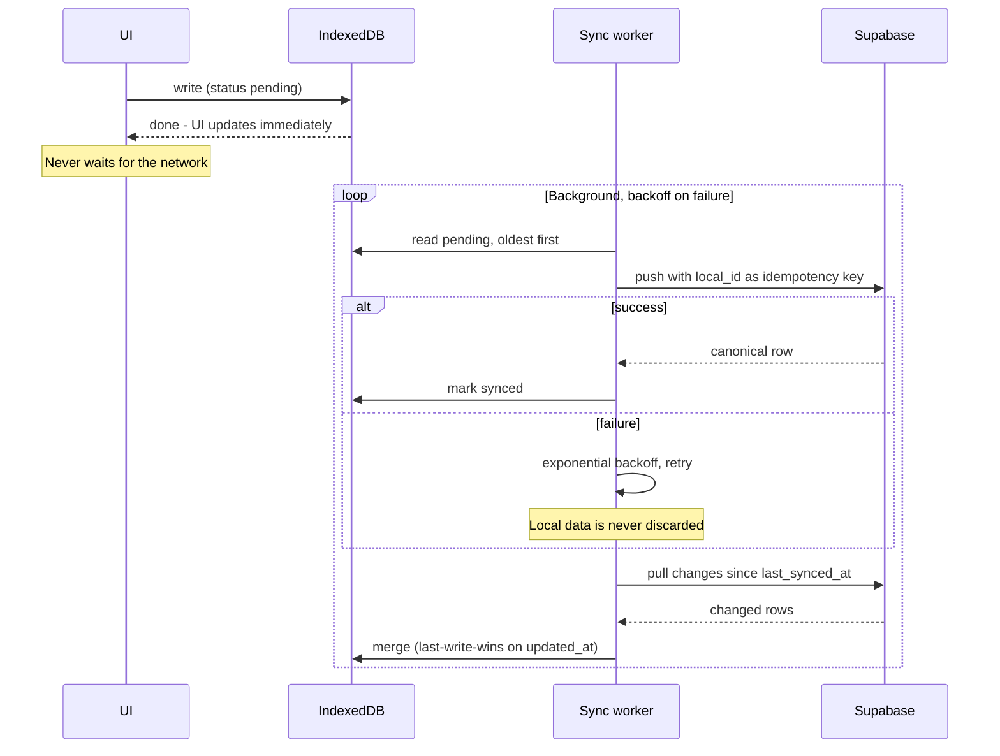

# 02 — System Architecture

**Last updated:** 18 Aug 2026 (rev 2) · **Status:** Final for MVP
**Read `07-DECISIONS.md` before changing anything here.**

---

## 1. Shape of the system

```
┌─────────────────────────────────────────────────────────────────────┐
│  CLIENT  — React + TypeScript + Vite                                │
│  Surfaces: Web · installable PWA · (later) Android via Capacitor    │
│                                                                     │
│  ┌───────────────────────────────────────────────────────────────┐  │
│  │ UI LAYER          Billing · Catalog · History · Settings      │  │
│  └───────────────────────────┬───────────────────────────────────┘  │
│  ┌───────────────────────────▼───────────────────────────────────┐  │
│  │ DOMAIN LAYER      pure TypeScript, no I/O, fully unit-tested   │  │
│  │  · pricing grammar      · money math (integer paise)          │  │
│  │  · validator + guards   · catalog index & matcher             │  │
│  │  · learning engine      · review/confidence rules             │  │
│  └───────────────────────────┬───────────────────────────────────┘  │
│  ┌───────────────────────────▼───────────────────────────────────┐  │
│  │ LOCAL STORE (IndexedDB)  ← the app ALWAYS reads/writes here    │  │
│  │  catalog · bills · learning · receipt-number block · settings │  │
│  └───────────────────────────┬───────────────────────────────────┘  │
│  ┌───────────────────────────▼───────────────────────────────────┐  │
│  │ SYNC WORKER       background, bidirectional, retry w/ backoff  │  │
│  └───────────────────────────┬───────────────────────────────────┘  │
└──────────────────────────────┼──────────────────────────────────────┘
                               │ HTTPS
        ┌──────────────────────┴───────────────────────┐
        ▼                                              ▼
┌────────────────────────┐              ┌──────────────────────────────┐
│ SUPABASE               │              │ EDGE FUNCTIONS (Netlify)     │
│  Postgres + RLS        │              │  /voice   transcribe + parse │
│  Auth (Google)         │              │  (single round trip)         │
│  Storage (logos)       │              │  auth-checked, rate-limited  │
└────────────────────────┘              └───────────┬──────────────────┘
                                                    ▼
                                    ┌───────────────────────────────┐
                                    │ TranscriptionProvider          │
                                    │  primary: Groq Whisper lg-v3   │
                                    │  fallback: Web Speech API      │
                                    ├───────────────────────────────┤
                                    │ ParseProvider                  │
                                    │  primary: Gemini Flash-Lite    │
                                    │  (only on fast-path miss)      │
                                    └───────────────────────────────┘
```

---

## 2. Local-first: the single most important structural decision

**The app never writes to the network directly.** It writes to IndexedDB. A sync worker reconciles
with Supabase in the background.

**One write path.** Offline is the normal case, not a special case. A bolted-on offline queue creates
two write paths and that is where the bugs live.

### Why sync is tractable here

| Data | Mutability | Conflict strategy |
|---|---|---|
| Finalised bills | **Immutable, append-only** | None possible. Insert-only. |
| Bill items | Immutable once the bill is finalised | None possible |
| Shop catalog | Mutable, low frequency | Last-write-wins on `updated_at` |
| Shop settings | Mutable, very low frequency | Last-write-wins on `updated_at` |
| Learning data | Additive counters | Max-wins on counters, union on sets |

Immutable bills are what make this a weekend problem instead of a distributed-systems problem.
**Never make a finalised bill editable.** If a bill is wrong, it is cancelled and a new one issued —
exactly as paper works.

### Sync protocol




| Step | Behaviour |
|---|---|
| Write | Domain → IndexedDB, marked `pending`. UI updates immediately. |
| Push | Worker sends `pending` rows oldest-first, with a client-generated `local_id` as the idempotency key |
| Confirm | Server returns canonical row; local row marked `synced` |
| Pull | Worker fetches rows changed since `last_synced_at` per table |
| Conflict | Only possible on catalog/settings → last-write-wins on `updated_at` |
| Failure | Exponential backoff, capped. Never blocks the UI. Never loses local data. |

**Idempotency:** every bill carries a client-generated UUID `local_id` with a unique constraint on
`(shop_id, local_id)`. Re-sending a bill is a no-op, so retries are always safe.

---

## 3. Offline levels

| Level | Capability | MVP |
|---|---|---|
| 1 | Read catalog, history, settings offline | ✅ |
| 2 | Create, edit, finalise bills offline; sync on reconnect | ✅ |
| 3 | Voice offline | ❌ Requires Web Speech offline pack — post-MVP |
| 4 | Multi-device concurrent editing | ❌ One device per shop in MVP |

**Required offline UX**

| Condition | Behaviour |
|---|---|
| Offline, browsing | Everything works. Small persistent "Offline" chip. No dialogs. |
| Offline, billing manually | Full function. Bill finalises normally with a reserved receipt number. |
| Offline, mic tapped | Mic disabled with a one-line reason. Not a silent failure, not an error modal. |
| Reconnect | Chip changes to "Syncing…", then clears. No user action required. |
| Sync fails repeatedly | Chip turns amber with a tap-for-detail. **Never blocks billing.** |

**Non-negotiable:** a half-built bill is never lost to a network blink.

---

## 4. Receipt numbering across offline

A sequential per-shop number cannot be assigned without the server.

**Block allocation:**

1. While online, the device reserves a block of 50 numbers → `receipt_number_blocks`
2. Offline bills draw from the reserved block
3. **The number shown to the customer never changes after sync**
4. Block below 10 remaining and online → reserve the next block
5. Block exhausted while offline → fall back to `{device_prefix}-{n}`, reconcile on sync and flag it

---

## 5. The voice path

One HTTP round trip, not two. See `04-VOICE-PIPELINE.md` for the full pipeline.

```
mic → audio blob → POST /voice (binary, not base64)
                     ├─ TranscriptionProvider  → transcript
                     └─ ParseProvider          → items   (only if the client asks)
                   ← { transcript, items?, usage, latency }
```

The client attempts **Layer 1 (deterministic)** on the transcript first. Only on a miss does it
request a parse. In steady state most utterances never reach the LLM.

### Provider interfaces

```ts
interface TranscriptionProvider {
  name: string;
  transcribe(audio: Blob, opts: {
    vocabulary?: string[];      // shop-scoped phrase biasing
    language?: string;
  }): Promise<{ text: string; confidence?: number; latencyMs: number }>;
}

interface ParseProvider {
  name: string;
  parse(transcript: string, opts: {
    catalogSlice: CatalogEntry[];
  }): Promise<{ items: ParsedItem[]; usage: TokenUsage; latencyMs: number }>;
}
```

Every provider decision is a config change, never a rewrite. This is what makes the Groq / Web
Speech / Sarvam question reversible.

---

## 6. Security

| Control | Rule |
|---|---|
| **Security boundary** | Postgres **RLS on `shop_id`**. Never client-side filtering. |
| API keys | Only ever in edge-function environment. Never in client code, never in the repo. |
| `.gitignore` | Must contain `.env`, `.env.*`, `!.env.example` before any key is created |
| Edge function auth | Every `/voice` call carries the Supabase JWT. Anonymous calls rejected. |
| Rate limiting | Per-shop quota on `/voice`. Prevents quota drain from a leaked URL. |
| HTML escaping | **Every** interpolated value in receipt HTML is escaped. `displayName`, `shopName`, `customerName` are user-controlled and end up in `innerHTML`. |
| Money | Integer paise. No float arithmetic anywhere in the stack. |
| Parser output | A parse response is a **proposal**. The validator decides what reaches the bill. |

**RLS negative tests are mandatory:** two shops, one authenticated as each, asserting zero
cross-visibility on every table. This is the test that matters most in the entire suite.

---

## 7. Environments and hosting

| | Dev | Prod |
|---|---|---|
| Frontend | Vite dev server | Netlify |
| Database | Supabase dev project | Supabase prod project |
| Functions | Netlify dev | Netlify |
| Migrations | Supabase CLI, versioned in repo | Same migrations, applied in order |

No staging while solo — it doubles maintenance for a single-user pilot. Add it when a second shop
goes live.

**Backups:** Supabase PITR enabled from the day the pilot shop enters real data.

---

## 8. Observability

Every `/voice` call logs, keyed by a `correlationId` that spans client and server:

```
audioBytes · sttProvider · sttLatencyMs · sttRetries
fastPathHit (bool) · fastPathReason
parseProvider · promptTokens · completionTokens · parseLatencyMs · parseRetries
itemCount · reviewFlagCount · totalMs
```

`promptTokens` / `completionTokens` come from the provider's usage metadata. The current app
discards Gemini's `usageMetadata` — capture it. Without these you cannot measure cost per bill,
and cost per bill is a design constraint in `01-PRD.md` §10.

Client additionally records **turns-to-bill** and **seconds-to-bill** per bill — the two primary
product metrics.

---

## 9. Running cost at pilot scale

| Item | Cost |
|---|---|
| Supabase | ₹0 — free tier (500 MB DB) is ample for one shop |
| Netlify | ₹0 — ~15k function calls/month against a 125k free limit |
| Groq + Gemini | ~₹300–500/month at 100 bills/day |
| Google Play developer | $25 one-time, only when Android ships |
| Domain | optional, ~₹800/year |

**~₹500/month.** Cost pressure appears only at scale, which is why the deterministic fast path is
in the architecture from day one rather than added later.

---

## 10. Directory structure

```
src/
  domain/            pure logic, zero I/O, 100% unit-tested
    money.ts           integer paise, all arithmetic
    grammar.ts         wala/ka pricing rules + deterministic parser
    catalogIndex.ts    prefix + n-gram index, matcher
    validator.ts       guards, unit conversion, review flags
    learning.ts        alias/product/price learning rules
  data/
    db.ts              IndexedDB schema + accessors
    sync.ts            sync worker
    supabaseClient.ts  client
  providers/           REACT CONTEXT providers only - ShopProvider, AuthProvider (KB-106/107)
  voice/               TranscriptionProvider/ParseProvider - see below (corrected `KB-206`,
                       was originally drawn as `providers/transcription/`+`providers/parse/`;
                       moved to avoid colliding with the React providers above - `KB-204`/`NI-24`)
    transcriptionProvider.ts · groqTranscriptionProvider.ts
    parseProvider.ts · geminiParseProvider.ts · pricingGrammarPrompt.ts
  ui/
    billing/ catalog/ history/ settings/ shared/
  app/                 routing, auth, providers

supabase/migrations/   versioned SQL
netlify/functions/     voice.mts (real extension - `.ts` here was illustrative, `KB-206`), _shared/
eval/                  voice cases, runner, number benchmark
docs/                  this documentation set
```

**Rule:** `domain/` never imports from `data/`, `providers/`, or `ui/`. It takes data in and returns
data out. This is what makes the pricing grammar and validator testable without a network, a
database, or a browser — and they are the parts that must never silently break.
