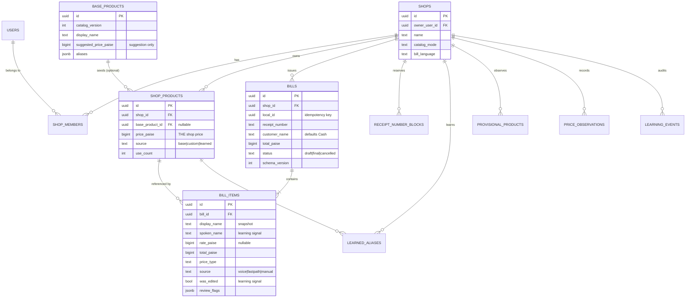

# 03 — Data Model and Schema

**Last updated:** 4 Oct 2026 (rev 8) · **Status:** Final for MVP

## 0. Where the catalog actually lives — read this first

**The database is the source of truth for every product. Always. There is no product file.**

`products.js` in the predecessor was a hardcoded JavaScript file. That is exactly what this schema
replaces. Products live in Postgres, in `shop_products`, per shop.

Three layers, which are easy to confuse:

| Layer | What it is | Where |
|---|---|---|
| **Source of truth** | The shop's real catalog. Authoritative. | **Postgres** (`shop_products`) |
| **Read cache** | A synced copy, so search is instant and works offline | IndexedDB |
| **Search index** | Prefix + n-gram index built in memory from the cache | RAM |

**Every write goes to Postgres.** Adding a product mid-bill, editing a price, bulk-importing an
Excel file — all of it is a database write. The cache is downstream of the database, never the
other way round.

**Why cache at all, rather than query the server per keystroke:** a type-ahead search fires on every
character. A network round trip per keystroke is 100–300 ms on Indian mobile data, which is visible
lag at the counter. And it stops working entirely when the connection drops. This is why
offline-capable POS systems — including Vyapar's desktop product — keep a local copy and sync.

**Scalability:** the cache is bounded, not unbounded. 500 products ≈ 80 KB. 5,000 ≈ 800 KB. Above
**10,000 products** the client falls back to server-side search (`KB-201`). Nothing about this caps
how many products a shop may have.

---

**Iron rules**
1. **All money is `BIGINT` paise.** Never `NUMERIC`, never `FLOAT`, never rupees.
2. **Every shop-owned table carries `shop_id`** and is protected by RLS.
3. **Finalised bills are immutable.** Wrong bill → cancel and reissue.
4. **Every syncable row carries `local_id`, `updated_at`, `device_id`.**

---

## 1. Entity overview



**`BASE_PRODUCTS` has no `shop_id`** — it is global, read-only and versioned. Everything else is
shop-scoped and protected by RLS.

---

## 2. Identity and shop

### `shops`
| Column | Type | Notes |
|---|---|---|
| `id` | `uuid` PK | |
| `owner_user_id` | `uuid` → `auth.users` | |
| `name` | `text` NOT NULL | Printed on receipts |
| `phone` | `text` | |
| `address` | `text` | |
| `logo_url` | `text` | Supabase Storage |
| `catalog_mode` | `text` | `'base_imported'` \| `'custom_only'` — chosen at onboarding |
| `bill_language` | `text` | `'en'` \| `'hi'` \| `'both'` — default **`'en'`** for new shops (D57, migration `20261004090000`; was `'hi'` — existing shops kept their value). The customer's receipt language (`KB-308`); set in Studio until `KB-312` — **with `updated_at = now()`** in the same update, or devices never pull it (KI-65) |
| `receipt_prefix` | `text` | e.g. `KB` |
| `created_at`, `updated_at` | `timestamptz` | |

### `shop_members`
`(shop_id, user_id, role)` where role ∈ `owner` \| `manager` \| `staff`.
**MVP: only `owner` rows exist and there is no UI.** The table exists so multi-staff is a feature,
not a migration.

---

## 3. Catalog

### `base_products` — global, read-only, versioned
| Column | Type | Notes |
|---|---|---|
| `id` | `uuid` PK | |
| `catalog_version` | `int` | Bumped when the base catalog is revised |
| `display_name` | `text` | |
| `source_category` | `text` | Provenance — the literal legacy catalog section a product came from (e.g. `"DALS / PULSES / LEGUMES"`), one of 48 values. **Never used for guard logic.** See `07-DECISIONS.md` D12. |
| `guard_category` | `text` | One of exactly sixteen values: `dal`, `oil`, `masala`, `tea`, `grain`, `soap`, `hygiene`, `dairy`, `snack`, `sweet`, `beverage`, `condiment`, `dryfruit`, `household`, `medicine`, `other`. **This is what the validator reads** to reject a mismatched match (a "daal" matching a soap) — precomputed at seed time, not inferred by keyword matching at runtime. `other` is under 2% of the catalog. See `07-DECISIONS.md` D12. |
| `default_unit` | `text` | |
| `suggested_price_paise` | `bigint` | **A suggestion only. Never used as a shop's price.** |
| `aliases` | `jsonb` | Hindi + Latin + Devanagari variants |
| `is_active` | `boolean` | |

Seeded from the existing 482 products. **No `shop_id`** — readable by all authenticated users,
writable by none.

### `shop_products` — the shop's real catalog
| Column | Type | Notes |
|---|---|---|
| `id` | `uuid` PK | |
| `shop_id` | `uuid` NOT NULL | RLS key |
| `base_product_id` | `uuid` NULL | Set if derived from base |
| `display_name` | `text` NOT NULL | |
| `category` | `text` | |
| `unit` | `text` NOT NULL | |
| **`price_paise`** | `bigint` NOT NULL | **The shop's price. Always lives here.** |
| `aliases` | `jsonb` | Base aliases + learned ones |
| `source` | `text` | `'base'` \| `'custom'` \| `'learned'` |
| `use_count` | `int` | Drives match boost and STT vocabulary rank |
| `sku` / `barcode` | `text` NULL | Reserved. Not used in MVP — see `12-PARKED.md` NI-11. |
| `is_active` | `boolean` | Soft delete — never hard-delete a product referenced by a bill |
| `local_id`, `device_id`, `updated_at` | | Sync fields |

**Unique:** `(shop_id, lower(display_name))`

**Why price lives here and nowhere else:** chini is ₹45 in one shop and ₹48 in another. A shared
price field would be wrong for someone on day one.

**Onboarding:** `catalog_mode = 'base_imported'` copies all active base products into
`shop_products` with `suggested_price_paise` as the starting price. `'custom_only'` starts empty.
Either way, base products can be pulled in and edited later, and base-catalog improvements are
**offered, never auto-applied** over a shop's edits.

---

## 4. Billing

### `bills`
| Column | Type | Notes |
|---|---|---|
| `id` | `uuid` PK | |
| `shop_id` | `uuid` NOT NULL | RLS key |
| `local_id` | `uuid` NOT NULL | Client-generated **idempotency key** |
| `receipt_number` | `text` NOT NULL | From the device's reserved block |
| `receipt_number_source` | `text` NOT NULL | `'block'` \| `'fallback'` (default `'block'`). Which allocation path produced the number — a permanent label, never a trigger for renumbering (`07-DECISIONS.md` D24). Pushed since `KB-110b`. |
| `customer_name` | `text` | Defaults to `'Cash'`. **Never blocks finalise.** `CHECK (char_length(customer_name) BETWEEN 1 AND 60)` — code points (`KB-306`, D52). |
| `customer_mobile` | `text` NULL | Optional. **Exactly 10 digits**, no +91: `CHECK (customer_mobile IS NULL OR customer_mobile ~ '^[6-9][0-9]{9}$')` (`KB-306`, D52). For the receipt's WhatsApp target and future udhaar. |
| `subtotal_paise` | `bigint` NOT NULL | |
| `total_paise` | `bigint` NOT NULL | |
| `status` | `text` | `'draft'` \| `'final'` \| `'cancelled'` |
| `schema_version` | `int` NOT NULL | Stamped on every bill. Non-negotiable. |
| `device_id` | `text` | |
| `created_at`, `finalized_at`, `synced_at` | `timestamptz` | |

**Unique:** `(shop_id, local_id)` · `(shop_id, receipt_number)` · `(id, shop_id)` (target of `bill_items`' composite FK, `KB-110b`)
`local_id` is a client-generated **UUID** (`crypto.randomUUID()`) — `push_bill` casts it; anything else is a permanent `22P02`.
**Immutable once `status = 'final'`.** Enforced by a trigger, not by convention.

### `bill_items`
| Column | Type | Notes |
|---|---|---|
| `id` | `uuid` PK | |
| `bill_id`, `shop_id` | `uuid` | |
| `line_no` | `int` | |
| `shop_product_id` | `uuid` NULL | NULL for one-off custom lines |
| `display_name` | `text` NOT NULL | **Snapshot.** Renaming a product must never change an old bill. |
| `spoken_name` | `text` NULL | What was actually said — **training data for the learning engine** |
| `qty` | `numeric(12,3)` | Quantities are genuinely fractional (0.5 kg). Not money. |
| `unit` | `text` | |
| `rate_paise` | `bigint` NULL | NULL when `price_type = 'total'` |
| `rate_unit` | `text` NULL | The unit `rate_paise` is per (`07-DECISIONS.md` D36) — "500 gm at ₹45/**kg**". `check ((rate_paise is null) = (rate_unit is null))`. No vocabulary check (units are free text — `KI-16`). Added `KB-110b`. |
| `total_paise` | `bigint` NOT NULL | |
| `price_type` | `text` | `'rate'` \| `'total'` \| `'default'` \| `'unknown'` |
| `source` | `text` | `'voice'` \| `'fastpath'` \| `'manual'` — measures fast-path coverage |
| `review_flags` | `jsonb` | `[{code, severity, acknowledged}]` — each flag the line carried at finalise, and whether the shopkeeper said "Theek hai" (`KB-307`, D54). A bill-level flag is stored on its anchor line. |
| `was_edited` | `boolean` | True if the user changed it after parsing — **the learning signal** |

### `receipt_number_blocks`
`(id, shop_id, device_id, block_start, block_end, next_number, allocated_at)`
Reserved while online, consumed offline. See `02-ARCHITECTURE.md` §4.

---

## 5. Learning tables

Full behaviour in `08-LEARNING-ENGINE.md`.

### `learned_aliases`
| Column | Notes |
|---|---|
| `shop_id`, `alias`, `shop_product_id` | The mapping |
| `hit_count` | Times confirmed |
| `confidence` | 0–1 |
| `source` | `'correction'` \| `'confirmation'` |

**Unique:** `(shop_id, lower(alias))`

### `provisional_products`
| Column | Notes |
|---|---|
| `shop_id`, `spoken_name` | Unknown item heard |
| `seen_count` | Auto-promotes at 3 |
| `suggested_unit`, `suggested_price_paise` | Modal values observed |
| `promoted_at`, `promoted_shop_product_id` | Set on promotion |

**Deliberately not used for fuzzy search** until promoted — only exact-alias hits. This stops one
bad guess polluting matching immediately.

### `price_observations`
`(shop_id, shop_product_id, observed_price_paise, occurred_at)`
Append-only. Feeds price-drift **suggestions**. Prices are **never auto-changed** — see §8.

### `learning_events`
`(shop_id, bill_id, event_type, payload jsonb, created_at)`
Append-only audit of every learning decision. Makes "why did it learn that?" answerable, and lets a
bad learning run be replayed or reversed.

---

## 6. Sync

### `sync_state` — client-side only (IndexedDB)
`(table_name, last_synced_at, cursor, pending_count)`

Every syncable table carries `local_id`, `device_id`, `updated_at`, and a client-side
`sync_status` ∈ `pending` \| `synced` \| `conflict`.

**Not every local table has the same shape.** `KB-109` (the IndexedDB layer) found three genuinely
different roles hiding under "mirror the server tables":

- **Local-first (push)**: `bills`, `bill_items`, and the four learning tables. Written locally first;
  real per-row `sync_status`; pushed by the sync worker (`KB-110`).
  **Bills push through `push_bill(p_bill, p_items)`** (`KB-110b`, D37): one SECURITY INVOKER Postgres
  function, one transaction — bill inserted as draft, items inserted, then finalised; an identical retry is a
  no-op, a divergent one is `KB409`. **Only `final`/`cancelled` bills are pushed; drafts stay on the device.**
  `bill_items` rows reference their bill through a composite FK `(bill_id, shop_id) → bills (id, shop_id)`, so an
  item can only belong to a bill of its own shop.
- **Read-cache (pull-only)**: `shop_products`, `base_products`. Per §0's own rule — *"every write goes
  to Postgres... the cache is downstream of the database, never the other way round"* — these rows are
  never written locally first and carry no meaningful per-row `sync_status`. Freshness is tracked at
  the table level, via `sync_state` alone.
- **Hybrid**: `receipt_number_blocks` — reserved with a real online write, then read and decremented
  locally while offline (§4 above). Neither pure shape.

**Local databases (`KB-315`, `07-DECISIONS.md` D38):** one IndexedDB database **per signed-in user**,
`kiranabill-<userId>` (all the tables above, plus a `meta` key/value table holding `activeShopId`), and one
per-installation database, `kiranabill-device`, holding the persistent `deviceId` and the last signed-in
`activeUserId` (offline sessions). Sign-out deletes neither. The `shop_products` pull cursor is kept per shop
(`sync_state` key `shopProducts:<shopId>`). Receipt blocks are pulled and consumed only by the device that
reserved them. The old shared `kiranabill` database is abandoned (never held bills).

**A local cache of `shops` is also required, even though no earlier section of this document said so
explicitly.** A receipt must render while offline (name, phone, `bill_language`, `receipt_prefix`,
`logo_url`) — that only works if these fields are cached locally, following the same last-write-wins
sync as any other shop setting. Stated here as a real requirement, not left as an inference buried in
a ticket for a future reader to have to re-derive.

---

## 7. RLS policies

Applied to **every** table with `shop_id`:

```sql
alter table <t> enable row level security;

create policy <t>_select on <t> for select
  using (shop_id in (select shop_id from shop_members where user_id = auth.uid()));

create policy <t>_insert on <t> for insert
  with check (shop_id in (select shop_id from shop_members where user_id = auth.uid()));

create policy <t>_update on <t> for update
  using (shop_id in (select shop_id from shop_members where user_id = auth.uid()));
```

`base_products`: `select` for `authenticated`; no insert/update/delete policy at all.

**Mandatory negative test:** two shops, authenticated as each, asserting zero rows visible from the
other on every table. This is the single most important test in the suite.

---

## 8. Money and rounding

| Rule | |
|---|---|
| Storage | `BIGINT` paise |
| Arithmetic | Integer only. No floats at any point. |
| Quantity | `numeric(12,3)` — a quantity is not money |
| `total_paise` when `price_type='rate'` | `round(qty × rate_paise)`, **half-up** rounding, computed **once** at line level. See `07-DECISIONS.md` D11 — this supersedes an earlier "banker's rounding" note that was never actually the right call for this product. |
| Bill total | Sum of already-rounded line totals. **Never re-round the sum.** |
| Display | Whole rupees by default; paise shown only when non-zero |

The predecessor prints `toFixed(0)` per line *and* on the sum, so a bill of ₹10.60 + ₹10.60 displays
as ₹11 + ₹11 = ₹21 and the lines visibly don't add up. Rounding once, at line level, fixes this.

**Why half-up, not banker's rounding.** Banker's rounding (round-half-to-even) exists to keep
*statistical* aggregates unbiased over many transactions — the right goal for accounting systems,
wrong goal for this product. The thesis here is that **the shopkeeper can trust the number in front
of them**, and a shopkeeper checking a total by hand or on a calculator expects ordinary half-up
rounding. At exactly 1516.5 paise, half-up gives ₹15.17; banker's rounding gives ₹15.16. Predictability
to the person reading the bill wins over statistical unbiasedness nobody at the counter is measuring.
See `07-DECISIONS.md` D11.

---

## 9. Indexes

```sql
create index on shop_products (shop_id) where is_active;
create index on shop_products (shop_id, lower(display_name));
create index on bills (shop_id, created_at desc);
create index on bills (shop_id, customer_name);
create unique index on bills (shop_id, local_id);
create unique index on bills (shop_id, receipt_number);
create index on bill_items (bill_id);
create index on bill_items (shop_id, display_name);
create index on learned_aliases (shop_id, lower(alias));
create index on provisional_products (shop_id, seen_count desc) where promoted_at is null;
```

---

## 10. Migration from the predecessor

One shop, ~200 localStorage bills. **No importer is built.**

Export a JSON from the old app, keep it as an archive, start clean. Building a versioned dry-run
importer for 200 rows of the author's own test data would be enterprise machinery for a problem that
doesn't exist.

**Carried forward by seeding, not importing:** the 482-product catalog becomes `base_products`.

---

## 11. Deliberately absent from MVP

`customers` · `ledger_entries` · `inventory` · `suppliers` · `expenses` · `gst_*` · `staff_sessions`

`bills.customer_name` and `bills.customer_mobile` exist so that when udhaar arrives, existing bills
can be matched into a real `customers` table rather than starting from nothing.
