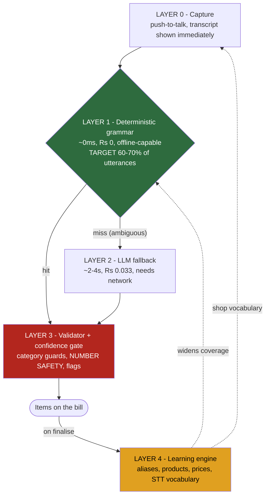

# 04 — Voice Pipeline

**Last updated:** 18 Aug 2026 (rev 2) · **Status:** Final for MVP

This is the differentiator. Everything else in the product is table stakes.

---

## 1. The five layers

```
     ┌─────────────────────────────────────────────────────────────┐
  0  │ CAPTURE + FEEDBACK                                          │
     │ push-to-talk · show transcript the instant it arrives        │
     └──────────────────────────────┬──────────────────────────────┘
                                    ▼
     ┌─────────────────────────────────────────────────────────────┐
  1  │ DETERMINISTIC GRAMMAR          ~0 ms · ₹0 · offline-capable  │
     │ regex + shop catalog index · TARGET: 60-70% of utterances    │
     │ returns null the moment anything is ambiguous                │
     └──────────────────────────────┬──────────────────────────────┘
                                    ▼ (miss only)
     ┌─────────────────────────────────────────────────────────────┐
  2  │ LLM FALLBACK                   ~2-4 s · ₹0.033 · needs net   │
     │ Gemini Flash-Lite · pricing-grammar prompt · catalog slice   │
     └──────────────────────────────┬──────────────────────────────┘
                                    ▼
     ┌─────────────────────────────────────────────────────────────┐
  3  │ VALIDATOR + CONFIDENCE GATE                                  │
     │ category guards · unit conversion · NUMBER SAFETY · flags    │
     │ a parse is a PROPOSAL; this layer decides what reaches the bill │
     └──────────────────────────────┬──────────────────────────────┘
                                    ▼
     ┌─────────────────────────────────────────────────────────────┐
  4  │ LEARNING ENGINE            see 08-LEARNING-ENGINE.md         │
     │ every bill feeds aliases, products, prices, STT vocabulary   │
     │ → widens Layer 1 coverage → Layer 2 called less over time    │
     └─────────────────────────────────────────────────────────────┘
```



**The property that makes this defensible:** Layer 4 feeds Layer 1. The more a shop bills, the more
utterances resolve locally — faster and cheaper every month. A competitor launching tomorrow starts
at 0% fast-path coverage and cannot buy past it. Coverage is earned per shop, per month.

---

## 2. Layer 0 — Capture

| Rule | |
|---|---|
| Interaction | **Push-to-talk.** Tap to start, tap to stop. Never continuous, never conversational. |
| Transport | Binary blob, not base64 — base64 inflates the payload 33% |
| Round trips | **One.** `/voice` does transcription and (if requested) parsing server-side. |
| Feedback | Show the transcript the moment it lands, before items resolve. Half of "slow" is not knowing whether it's working. |
| Offline | Mic disabled with a one-line reason. Never a silent failure. |
| Long utterances | **No length limit.** Multi-item speech is the point. |

**STT provider:** Groq Whisper large-v3 (not turbo — 22.3% vs 15.7% WER).
**Phrase biasing:** every call carries the shop's top ~40 product names, ranked by `use_count`,
capped at 600 characters (Whisper's prompt window is ~224 tokens).
**Confidence:** Groq's real response carries no usable per-utterance confidence score in any response
format — verified against the live API in `KB-204`. `TranscriptionProvider.transcribe()`'s
`confidence?` is permanently unset for this provider. See `07-DECISIONS.md` D25.

---

## 3. Layer 1 — Deterministic grammar

### The pricing grammar

Kirana speech encodes price semantics in postpositions. These five rules are the core IP.

| Rule | Trigger | Meaning | Example |
|---|---|---|---|
| **1** | `wala` / `wali` | number is the **per-unit rate** | "chawal 5kg **50 wala**" → qty 5 kg, rate ₹50, total ₹250 |
| **2** | `ka` / `ki` | number is the **line total** | "chawal 5kg **30 ka**" → qty 5 kg, rate null, total ₹30 |
| **3** | bare price | treat as **total**, not rate | "5 kg aata 170 rupay" → total ₹170 |
| **4** | same item, different price | **separate lines**, never merge | "sabun 30 rupay" + "sabun 180 rupay" stay apart |
| **5** | bare item, no qty or price | **do not guess** — flag for review | "ajwain" → qty null, total 0, `price_type: 'unknown'` |

Rule 5 is the mature one. Most products would invent a default. This refuses to, and marks the line
for the shopkeeper to complete.

> ⚠️ **The grammar currently fails its own tests.** Eval case VC013 ("5 kg chawal 30 ka") returns
> `price_type: 'rate'` and ₹100 instead of ₹30. VC001 and VC009 fail the default-price path.
> **Phase 0 fixes this before anything else is built.** Porting a broken differentiator to a new
> stack makes it broken and more expensive to fix.

### Patterns handled deterministically

```
[qty] [unit] [product] [rate] wala|wali     → rate  = N, total = qty × N
[qty] [unit] [product] [price] ka|ki        → total = N, rate  = null
[qty] [unit] [product] [price] (bare)       → total = N
[qty] [unit] [product]                      → rate  = shop default
[qty] [product]                             → unit = piece, shop default
[product] [qty] [unit] [price] ka|ki        → as row 2
```

- Hindi numerals: `ek do teen chaar paanch chhe saat aath nau das bees pachas sau`
- Fractions: `aadha` (0.5) `paav` (0.25) `sawa` (1.25) `dedh` (1.5) `dhai` (2.5) `paune` (−0.25)
- Units and aliases: `kilo/kg/kilogram`, `gram/gm`, `litre/liter/ltr`, `packet/pkt`, `piece/pcs`, `dozen`, `bori/bag`

### The bail-out rule — the most important line in this layer

**Return `null` the moment anything is ambiguous.** Layer 2 is the fallback and it is cheap relative
to a wrong bill. A wrong fast-path answer is far worse than a slow correct one.

Bail out on: unrecognised token · product match below the strict threshold · two numbers with
unclear roles · conflicting units · any unparsed remainder.

Product match in Layer 1 uses a **stricter** threshold than Layer 2, because there's no LLM
sanity-check behind it.

### Instrumentation

Log `fastPathHit` / `fastPathMiss` with a reason on every utterance. **Fast-path coverage is a
tracked product metric**, target ≥60%.

---

## 4. Layer 2 — LLM fallback

| | |
|---|---|
| Provider | Gemini Flash-Lite via `ParseProvider` |
| Called | **Only on Layer 1 miss** |
| Prompt | Static pricing-grammar rules + a relevance-ranked catalog slice |
| Catalog slice | Top 30 relevant products, down from the predecessor's 80 — measure whether accuracy drops before assuming it does |
| Caching | Cache the static grammar block; it is byte-identical on every call and ~43% of the prompt |
| Temperature | 0.1 |
| Retries | 3 with exponential backoff, then a fallback model |
| Output | Strict JSON array of proposed items |

**A parse response is a proposal, never financial truth.** It always passes through Layer 3.

---

## 5. Layer 3 — Validator and confidence gate

### Preserved from the predecessor (do not lose these in the rewrite)

| Guard | Behaviour |
|---|---|
| **Category guards** | Six semantic buckets (dal, oil, masala, tea, grain, soap). If the spoken phrase is clearly a dal and the best match is a soap, **reject the match** rather than accept it. |
| **Length-scaled thresholds** | A 4-character word needs ~0.98 score; a multi-word phrase ~0.74. Short words are dangerous. |
| **Phonetic variants** | ph↔f, w↔v swapping so "phorchune"/"fortune" both land |
| **Unit conversion with rate-basis inference** | "500 gram" with a rate ≥10× the gram default infers a per-kg rate and converts |
| **Review reason codes** | 11 codes surfaced as badges with explanations |

### Number safety — the differentiating claim

**A wrong name is visible.** The shopkeeper sees `पैपेट` and catches it.
**A wrong number is invisible.** It looks completely normal and goes out the door.

Pilloo — the best-recognising app in this category — heard तीस as पीस, silently ignored the price,
and printed **₹300 for a ₹150 bill** on an invoice that looked perfect. Nothing warned the user.

| Signal | Severity | Behaviour |
|---|---|---|
| Rate >3× or <0.2× the shop's price | **HIGH** | Loud inline warning. Cannot finalise unacknowledged. |
| Number in transcript, absent from items | **HIGH** | Flag: "did you mean…?" Pilloo silently lost "15 किलो". |
| Two numbers in an utterance, one consumed | **HIGH** | Flag the line |
| Qty parsed then dropped | **HIGH** | Flag |
| `price_type: 'unknown'` (Rule 5) | MEDIUM | REVIEW badge, line editable, **bill still finalisable** |
| Product matched below confidence | MEDIUM | REVIEW badge |
| Product not in catalog | LOW | Add anyway, flag, keep going. **Never block.** |

**HIGH flags gate finalisation.** MEDIUM and LOW never do — they inform.

**Never blocking, ever:** an unknown product, a missing customer name, a missing rate.

---

## 6. Layer 4 — Learning

Fully specified in `08-LEARNING-ENGINE.md`. In summary: every finalised bill feeds learned aliases,
provisional products, price observations and the STT vocabulary — which widens Layer 1 coverage, so
Layer 2 is called less over time.

---

## 7. Interaction rules — product law

1. **Never block on an unknown product.** Flag and continue.
2. **Never ask a question mid-bill.** Customer name defaults to "Cash" and is fillable any time.
3. **Never degrade to nothing.** When voice fails, type-ahead search is right there.
4. **Never silently drop a number.** If it was heard and isn't on the bill, say so.

These exist because Pilloo violates 1, 2 and 4, and that is why it needs four turns and produced a
2× wrong total.

---

## 8. Evaluation

The eval is not optional infrastructure — it is how the differentiator is defended.

### Current state
0 pass · 10 warn · 3 fail · 12 never run. Fixtures hardcode prices the catalog has since changed
(VC001 expects chini at ₹43, catalog says ₹45) and expect display names that no longer exist
(`कनकी`, `Ganesh Poha`).

### Required rebuild

| Fix | |
|---|---|
| Prices | Derive from the catalog at runtime. Never hardcode. |
| Matching | Match on catalog **id**, not display string |
| Coverage | All 25 cases run, live, recorded as a baseline |
| Separation | Report **transcription errors separately from parsing errors.** 10 of 13 recorded cases had a wrong transcript but correct items — that resilience is a real strength and the current harness hides it. |

### The number benchmark — new, and the important one

100 utterances built specifically to stress numbers, because number accuracy is the product claim
and **no ASR vendor publishes it**:

- Hindi numerals: `ek do teen … das bees pachas sau`
- Fractions: `aadha paav sawa dedh dhai paune`
- `X wala` vs `X ka` on the same product
- Two-number utterances: "5 kg chawal 30 ka"
- Confusable pairs: तीस/पीस · दस/दीस · बीस/तीस

**Scored on number accuracy first, overall WER second.** A model with 17% WER that gets numbers
right is safer than one with 7% WER that doesn't.

### Release gate

**Zero silent number errors across 20 consecutive real bills in the pilot shop.**
Non-negotiable. A billing app that is silently wrong about money is not shippable.

---

## 9. Cost model

| Path | Latency | Cost/utterance |
|---|---|---|
| Layer 1 hit | ~300 ms | STT only (~₹0.009) |
| Layer 2 fallback | ~2–4 s | STT + LLM (~₹0.043) |

At 100 bills/day, 2.5 utterances per bill:

| Fast-path coverage | ₹/month |
|---:|---:|
| 0% (today) | ~482 |
| 60% | ~200 |
| 70% | ~165 |

Against a realistic ₹167–383/month subscription ceiling, **the fast path is what makes the product
sellable**, not an optimisation.

---

## 10. Open items — all closed

Closed 17 Aug 2026. See `07-DECISIONS.md` rev 3. **Do not re-investigate these.**

| # | Question | Resolution |
|---|---|---|
| **O2** | Sarvam pricing | **Dropped.** Groq Whisper large-v3 is the decision. `TranscriptionProvider` keeps it reversible. |
| **O3** | Why was the fast-path regex experiment rolled back? | **Void — no such experiment.** The note came from an AI-generated summary, not from the owner. Build Layer 1 fresh with no inherited assumption. |
| **O4** | Does Pilloo implement `ka`/`wala`? | **It does not.** Owner tested "chawal 5 kilo tees wala" vs "...tees ka" — Pilloo returns the same amount for both. **The pricing grammar is a confirmed differentiator and may be claimed.** |

**The one genuinely unresolved item in this document** is the `paune` / `chataak` conflict in
`14-LEGACY-REFERENCE.md` §3 — the Gemini prompt has `chataak=0.05` which the code dictionary lacks,
and `paune=0.75` is wrong in context (*"paune do"* is 1.75, not 0.75). **Resolve in `KB-005`.
Do not invent the answer — decide the rule, write the test, make both sources agree.**
