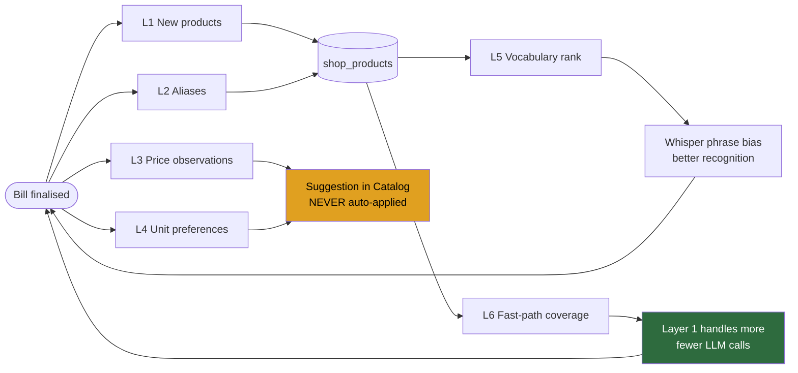

# 08 — Learning Engine

**Last updated:** 18 Aug 2026 (rev 2) · **Status:** Final for MVP

**Principle:** every bill makes the next bill better, for this shop specifically.

This is the only genuinely **compounding** advantage in the product. Recognition quality can be
matched by a competitor with a better model. Shop-specific accumulated knowledge cannot — it is
earned per shop, per month, and a competitor launching tomorrow starts at zero.

---

## 1. What gets learned

Every finalised bill produces up to six kinds of learning.

| # | Learned | From | Consumed by |
|---|---|---|---|
| **L1** | **New products** | Item spoken but not in the shop catalog | Catalog, search, fast path, STT vocabulary |
| **L2** | **Aliases** | `spoken_name` ≠ final `display_name` | Matcher, fast path |
| **L3** | **Prices** | `rate_paise` repeatedly differing from the shop's stored price | Price-drift **suggestions** (never auto-applied) |
| **L4** | **Units** | Unit repeatedly overridden for a product | Product default unit |
| **L5** | **Vocabulary rank** | `use_count` per product | Whisper phrase biasing (top ~40) |
| **L6** | **Fast-path coverage** | Learned aliases and products | Layer 1 handles more without an LLM |



**The loop:** L1 and L2 widen what Layer 1 can parse deterministically. L5 makes the STT hear this
shop's products better. Both reduce Layer 2 calls. **The app gets faster and cheaper the more it is
used.**

---

## 2. The signal nobody else has: user edits

Every time the shopkeeper corrects something after voice, that is a **free labelled training pair**.

| The user did | The system learns |
|---|---|
| Changed the product name on a voice line | `spoken_name → corrected name` becomes an alias (L2) |
| Filled a rate on a Rule-5 unknown item | Price observation + promotion evidence (L1, L3) |
| Changed the unit | Unit preference for this product (L4) |
| Deleted a line entirely | Negative signal — **suppress** that alias mapping |
| Accepted with no edits | Positive confirmation — raise alias confidence |

This is why `bill_items` carries **`spoken_name`** and **`was_edited`**. Without those two columns
there is no learning signal, and adding them later means the data was never captured.

---

## 3. L1 — New product learning

The flow the owner asked for: *a new product gets added to the database and the system learns it.*

```
"ajwain" spoken → not in shop catalog
        ↓
Item added to the bill with a REVIEW flag        ← NEVER blocks. Never asks.
price_type = 'unknown', qty null, total 0
        ↓
Shopkeeper fills qty and price, finalises
        ↓
provisional_products: seen_count++ · record unit + price observed
        ↓
   ┌────────────────────────┴────────────────────────┐
   ▼                                                 ▼
seen_count reaches 3                    Shopkeeper taps "Save to catalog"
   │                                                 │
   └────────────────────┬────────────────────────────┘
                        ▼
        Promoted → shop_products (source = 'learned')
        price = modal observed price · unit = modal observed unit
                        ▼
        Immediately available to: search · fast path · STT vocabulary
```

**Two promotion routes, deliberately:**

- **Automatic at 3 sightings** — zero effort, catches everything eventually
- **Manual, one tap** — instant, for when the shopkeeper knows they'll sell it again

**Why provisional products are excluded from fuzzy search until promoted:** a single mishearing
would otherwise pollute matching immediately. Provisional entries match on **exact alias only**. The
three-sighting threshold is the app watching before it trusts.

---

## 4. L2 — Alias learning

```
Voice heard: "पाले जी"  →  matched/corrected to: "Parle-G"
                       ↓
learned_aliases: (shop_id, "पाले जी") → Parle-G, hit_count = 1, confidence 0.5
                       ↓
Confirmed again without edit → hit_count 2, confidence 0.7
                       ↓
confidence ≥ 0.8 → treated as an exact alias
                → added to shop_products.aliases
                → available to the deterministic fast path
```

| Rule | |
|---|---|
| Source | Only from finalised bills. Drafts teach nothing. |
| Promotion | confidence ≥ 0.8 |
| Suppression | If the user deletes a line that used a learned alias, **decrement confidence.** Two suppressions retire it. |
| Scope | **Strictly per-shop.** Never global. |
| Conflict | One alias may map to only one product per shop. A newer mapping with higher confidence wins; the event is logged. |

**Suppression matters as much as promotion.** A learning system that only accumulates eventually
learns something wrong and never unlearns it.

---

## 5. L3 — Price learning: suggest, never auto-apply

**Decision: prices are never changed automatically.**

This derives directly from the product thesis. *Never silently get a number wrong* is incompatible
with silently changing a price. A one-off discount, a wholesale rate, or a mistyped rate would
otherwise become the shop's permanent price.

```
Bill line: chini at ₹48   ·   shop_products price: ₹45
                ↓
price_observations: append (₹48, timestamp)
                ↓
≥3 observations of the same different price in 30 days
                ↓
Non-blocking suggestion in Catalog:
"Chini billed at ₹48 five times. Update the price from ₹45?"   [Update] [Ignore]
```

`[Ignore]` suppresses that suggestion for 90 days. Suggestions never appear during billing — only in
the Catalog screen, where the shopkeeper is already thinking about prices.

---

## 6. L4 — Unit learning

Same shape as L3. If a product's unit is overridden 3+ times to the same alternative, suggest
changing the product's default unit. Never auto-apply.

---

## 7. L5 — Vocabulary for speech recognition

The most direct accuracy lever, and the one a generic competitor structurally cannot pull.

```
Ranked shop vocabulary =
    1. Products billed recently, by frequency          (strongest signal)
    2. Learned + promoted products, by use_count
    3. Brand-like catalog names (multi-word or Latin)  (Whisper mangles these most)
    → top 40 names, capped at 600 chars
    → sent as the Whisper `prompt` on every transcription
```

Whisper's prompt window is ~224 tokens, so the cap is a hard technical limit, not a preference.

**Why it works:** Pilloo must bias toward a global catalog covering every shop in India. KiranaBill
biases toward *this shop's fifty real items*. Same model, better priors.

**Expected effect** — the errors this should reduce, all observed in the current eval:
`पाले जी` → Parle-G · `पैपेट` → packet · `दूथ` → doodh · dropped "chakki" in "chakki aata"

**Measurement:** re-run the eval before and after. If brand-name errors drop, this is the recognition
story.

---

## 8. When learning runs

| Trigger | Runs |
|---|---|
| Bill finalised | All learning, locally, synchronously, against IndexedDB |
| Sync | Learning rows push like any other data |
| Offline | Works fully. Learning is local-first like everything else. |
| Draft abandoned | **Nothing is learned.** Only finalised bills teach. |

Learning must never add perceptible latency to finalisation. It runs on already-committed local
data, after the receipt is shown.

---

## 9. Auditability

Every learning decision appends to `learning_events`:

```json
{
  "event_type": "alias_promoted",
  "bill_id": "…",
  "payload": {
    "alias": "पाले जी",
    "shop_product_id": "…",
    "confidence_before": 0.7,
    "confidence_after": 0.85,
    "trigger": "confirmed_without_edit"
  }
}
```

This makes *"why did it learn that?"* answerable, and lets a bad learning run be inspected and
reversed. A learning system you cannot audit is one you cannot trust with money.

**Settings → Developer Mode** exposes: learned aliases with confidence, provisional products with
counts, pending price suggestions, and a **reset-learning** action.

---

## 10. Safety rules

| # | Rule | Why |
|---|---|---|
| 1 | **Per-shop only, never global** | The predecessor defaults `getLearningScopeId()` to `"global"` — every device shares one pool. Silent multi-tenancy break. |
| 2 | **Only finalised bills teach** | Drafts contain mistakes in progress |
| 3 | **Never auto-change a price or a unit** | Incompatible with "never silently wrong about a number" |
| 4 | **Provisional products never enter fuzzy search** | One mishearing would pollute matching immediately |
| 5 | **Suppression is symmetric with promotion** | A system that only accumulates eventually learns something wrong forever |
| 6 | **Every decision is logged** | Unauditable learning is untrustworthy |
| 7 | **Learning never blocks the UI** | It runs after the receipt is shown |

---

## 11. What this looks like over time

| Month | Fast-path coverage | Bills reaching the LLM | Effect |
|---|---|---|---|
| 1 | ~40% | 60% | Catalog aliases only |
| 3 | ~60% | 40% | Shop's real vocabulary learned |
| 6 | ~70%+ | <30% | Faster, cheaper, more accurate than day one |

A competitor with a better model still starts every new shop at month one.
