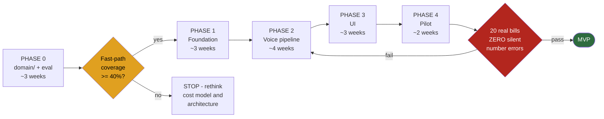
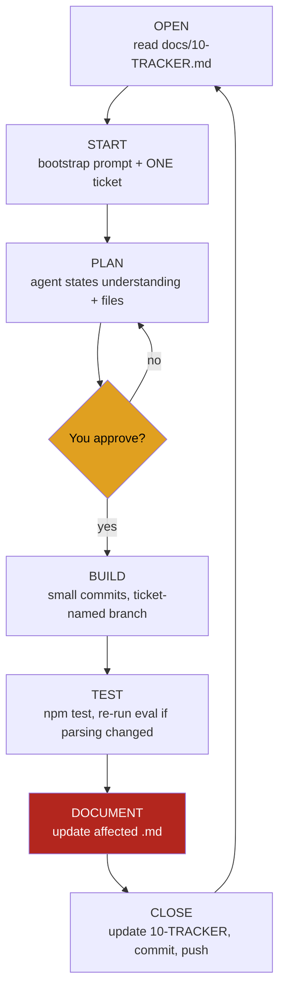

# 15 — Build Guide

**Last updated:** 18 Aug 2026 (rev 2) · **Status:** Active
**Supersedes:** rev 1, which recommended multiple tools including Lovable.

How to actually build this, alone. Read `09-WORKING-AGREEMENT.md` alongside it — that covers the
session protocol, this covers sequence and tooling.

---

## 1. The tool decision

**Antigravity, for everything, through MVP.** Codex as backup only.

| | Role |
|---|---|
| **Antigravity** | Primary. All phases. Google AI Pro already covers it. |
| **Codex** (ChatGPT Go) | Backup only: quota exhaustion mid-ticket, or a bug you've been stuck on for over an hour and want different reasoning on. |
| Everything else | Not used. |

### Why Antigravity, beyond the quota

**It is an IDE.** You will own this codebase alone for years. Working where you see every file being
changed means you learn your own system. A cloud agent that returns finished diffs optimises for
throughput — and throughput is not the constraint here. Understanding is. When something breaks in
month eight at 8pm with customers waiting, you need to know where things are.

### Why not Lovable, reversing rev 1

Rev 1 suggested Lovable for Phase 3 UI scaffolding. Dropped, for three reasons:

1. `13-DESIGN.md` and `05-FRONTEND-SPEC.md` already specify the UI precisely. The scaffolding value
   was in *deciding* the UI, and that's decided.
2. It generates in its own idiom, so you'd export and then reconcile — extra work, not less.
3. One tool, one code style, no import friction. Simpler wins for one person.

### Why one tool at all

Tool-chasing is a genuine failure mode for solo developers. Every switch costs a re-bootstrap, and
comparing tools quietly consumes weeks. **Pick one, ship the MVP, reassess after.** Nothing here
locks you in — `09-WORKING-AGREEMENT.md`'s bootstrap prompt means any tool can pick up the project
from the docs at any time.

---

## 2. MCP servers: install none yet

Every connected MCP injects its tool definitions into every request. Ten MCPs make the agent
*worse* — less context left for your code.

From Antigravity's catalogue, exactly three are ever relevant:

| MCP | Install when | Cost | Why |
|---|---|---|---|
| **Supabase** | Phase 1, not before | Free | Inspect schema, verify RLS, check migrations |
| **Chrome DevTools** | Phase 3 | Free | Let the agent verify UI it just built |
| **GitHub** | Optional, any time | Free | Git CLI does the same. Skip unless you want issue integration. |

Everything else in that catalogue — Stripe, BigQuery, Kubernetes, Looker, PayPal, Firebase, Neon,
MongoDB — is irrelevant to this product. None of them require payment to *install*; the underlying
services may, but you aren't using them.

> ⚠️ **The Supabase MCP can execute SQL.** Giving an agent write access to your database is a real
> risk. Use a read-only token if the option exists. **Migrations stay as committed files that you
> apply yourself** — never let the agent alter the schema directly.

### Graphify — parked, not rejected

A knowledge-graph layer over the codebase, to cut the tokens an agent spends navigating files.

**Honest position: I don't know this tool.** It postdates my knowledge and I can't verify its
licence, maintenance status, or whether it uploads code anywhere. Evaluate that yourself before
installing.

**On principle: not now.** The problem it solves — an agent unable to hold a large codebase — does
not exist at Phase 0, because you have no code. And you already have a curated context layer: 17
hand-written documents, more accurate than any auto-generated graph.

**Trigger to reconsider: Phase 3**, when `src/` is large enough that the agent starts missing
cross-file relationships. Recorded as `NI-13` in `12-PARKED.md`.

---

## 3. Session one: no AI at all

Do the restructure yourself. **Do not let an AI's first action on this project be moving your only
copy of the code.**

### Step 1 — back up

Copy the folder somewhere safe. Zip it. Thirty seconds, and it removes all fear from what follows.

### Step 2 — target structure

```
kiranabill/
├── docs/                  ← all 17 .md files. THE SOURCE OF TRUTH.
├── legacy/                ← every old file. READ-ONLY. Never imported.
├── src/
│   ├── domain/            ← Phase 0 lives here. Pure TS, zero I/O.
│   ├── data/
│   ├── providers/
│   ├── ui/
│   └── app/
├── eval/                  ← harness + the 25 voice cases
├── supabase/migrations/
├── netlify/functions/     ← the new /voice endpoint
├── .env.example
├── .gitignore
├── package.json
└── tsconfig.json
```

### Step 3 — the moves

```bash
cd kiranabill
git init

# .gitignore FIRST, before anything else exists
printf 'node_modules/\ndist/\n.env\n.env.*\n!.env.example\n.DS_Store\n' > .gitignore

mkdir -p legacy docs src/{domain,data,providers,ui,app} eval supabase/migrations
cp eval/voice-cases.json /tmp/voice-cases.json 2>/dev/null || true
mv products.js voice.js validator.js learning-store.js billing-ui.js app.js \
   index.html styles.css local-dev-server.js legacy/
mv netlify legacy/netlify
mv eval legacy/eval-old 2>/dev/null || true
mkdir -p eval && cp /tmp/voice-cases.json eval/ 2>/dev/null || true

# copy the 17 docs into docs/
git add -A && git commit -m "chore: restructure - legacy isolated, new tree scaffolded"
```

### Step 4 — seal legacy

`legacy/README.md`:

```
Reference material, not source code.
- Never imported by src/
- Never built, linted, or tested
- Never edited

The knowledge worth keeping is already in docs/14-LEGACY-REFERENCE.md.
Read that first. Come here only when it isn't enough.
```

Add `legacy` to `tsconfig.json` `exclude` and to the linter ignore list. **If it can't be imported,
it can't leak.**

### Step 5 — rotate the keys

Full account and key setup is in `17-MANUAL-TASKS.md`.

`.gitignore` exists now, so do `KB-001`. Rotate Groq and Gemini. Fifteen minutes. No more deferring.

**End of session one.** You have a clean repo, a committed structure, and no exposed secrets.

---

## 4. Session two: onboarding, no code

Open Antigravity. Run the **A0 onboarding prompt** from `09-WORKING-AGREEMENT.md`. The agent reads
all 18 documents and writes a summary. It writes no code.

Read the summary properly. If it has the thesis wrong, thinks udhaar is in scope, or wants floats
for money — correct it here, where nothing can break. This is the cheapest place to catch a
misunderstanding.

**This is the only session where the agent reads everything.** Every session after is one ticket,
and it reads only what that ticket needs.

---

## 5. Session three: the smallest possible first ticket

Bootstrap prompt from `09-WORKING-AGREEMENT.md` A1, then:

```
Today's ticket is KB-000.

Set up: Vite + React + TypeScript + Vitest + Tailwind.
Create src/domain/, src/data/, src/providers/, src/ui/, src/app/ - all empty.
Configure tsconfig to EXCLUDE legacy/.
Add one trivial test in src/domain/ so I can verify `npm test` runs.
Configure Tailwind with the design tokens from docs/13-DESIGN.md section 8.

Do not create any components, screens, or logic. Scaffold only.
```

Deliberately tiny. It verifies the tool, the setup and the workflow before anything valuable depends
on them. If Antigravity handles this cleanly, it'll handle the rest.

---

## 6. Phase sequence



### Phase 0 — `domain/` · ~3 weeks

Pure TypeScript. No UI, no database, no browser. Highest-risk work first, testable with `npm test`.

| Order | Ticket |
|---|---|
| 1 | `KB-001` rotate keys (done in session one) |
| 2 | `KB-000` scaffold |
| 3 | `KB-003` `money.ts`, `catalog.ts`, seed 482 products from `legacy/products.js` |
| 4 | `KB-002` `commands.ts` — no catalog alias may finalise a bill |
| 5 | `KB-004` eval harness, all 25 cases, **baseline recorded** |
| 6 | `KB-005` **`grammar.ts`** — five rules, failing tests first. Resolve the `chataak`/`paune` conflict (`14-LEGACY-REFERENCE.md` §3). |
| 7 | `KB-005b` `validator.ts` + `catalogIndex.ts` — indexed, not O(n) |
| 8 | `KB-005c` **the CLI** — see §6 |
| 9 | `KB-008` `learning.ts` |
| 10 | `KB-006` 100-utterance number benchmark |
| 11 | `KB-009` **fast-path coverage probe** |

**Exit gate:** all five pricing rules pass · 25/25 eval baseline recorded · number-accuracy baseline
recorded · **fast-path coverage measured** · index under 16 ms at 10,000 products.

> **If coverage comes back under ~40%, stop before Phase 1.** The cost model, latency story and moat
> argument all assume 60–70%. Finding out in week three costs three weeks. Finding out in month four
> costs four months.

### Phase 1 — Foundation · ~3 weeks

`KB-101`…`KB-111`. Install the **Supabase MCP** here. Build vertically: auth working end-to-end and
visible before touching the catalog.

**Exit gate:** sign in → create shop → import base catalog → add a product → go offline → add
another → reconnect → both in Postgres. RLS negative tests pass.

### Phase 2 — Voice pipeline · ~4 weeks

`KB-201`…`KB-210`. `domain/` already exists and is tested; this connects it to the world.

**Exit gate:** five-item spoken order → items appear → fast path handles simple ones with no LLM
call → number flags fire on a deliberately wrong rate.

### Phase 3 — UI · ~3 weeks

`KB-301`…`KB-314`. Install **Chrome DevTools MCP**. Feed the agent `13-DESIGN.md` and
`05-FRONTEND-SPEC.md` per screen — **one screen per ticket**, never "build the whole UI."

**Exit gate:** every screen works on phone and desktop · offline chip behaves · half-built bill
survives a network drop.

### Phase 4 — Pilot · ~2 weeks

`KB-401`…`KB-406`. PWA manifest, performance pass, PITR, metrics, **the 20-bill run**.

**Release gate:** `06-FEATURE-TICKETS.md`. **Zero silent number errors is a stop, not a target.**

---

## 7. Phase 0 has no visible output — plan for it

Three weeks of TypeScript and passing tests with nothing to look at. That is genuinely demotivating
alone, and it is exactly when discipline slips and people jump to building pretty screens.

**`KB-005c` — build a CLI right after the grammar works.** Fifteen lines:

```bash
$ npm run try "chawal 5 kilo tees ka"
  Chawal    5 kg    rate —    total ₹30    [total]
  fast path: HIT (2ms)

$ npm run try "chawal 5 kilo tees wala"
  Chawal    5 kg    rate ₹30  total ₹150   [rate]
  fast path: HIT (2ms)
```

Costs almost nothing, turns invisible work into something you can demo to yourself, and becomes your
fastest debugging tool for the rest of the project. It is also the exact demo that proves the
differentiator — **Pilloo returns the same amount for both of those lines.**

---

## 8. The daily loop



**The two steps that get skipped are PLAN and DOCUMENT**, and skipping either is how a disciplined
project becomes vibe-coded. PLAN stops the agent rewriting files you didn't ask about. DOCUMENT
stops the next session reading a lie.

---

## 9. Failure modes

| Symptom | Cause | Fix |
|---|---|---|
| Agent invents a schema field | Didn't read `03-DATA-MODEL.md` | Stop. Re-bootstrap. Point at the doc. |
| Agent rewrites files you didn't ask about | No agreed plan | Always PLAN → CONFIRM before BUILD |
| Docs drift from code | DOCUMENT skipped | Ticket isn't closed until docs are updated |
| Quota hits mid-ticket | Expected | Switch to Codex with the same bootstrap prompt |
| Agent gets slower and vaguer over a long session | Context filled up | Start a fresh session. Bootstrap again. |
| Tempted to skip Phase 0 for the pretty UI | Very normal | A beautiful app that bills ₹100 instead of ₹30 is worthless |
| Weeks lost comparing AI tools | Tool-chasing | One tool per phase. Ship the phase. |
| Good idea mid-ticket | Scope creep | `12-PARKED.md` §C. Keep working. |

---

## 10. Timeline

| Phase | Estimate |
|---|---|
| 0 — domain | 3 weeks |
| 1 — foundation | 3 weeks |
| 2 — voice pipeline | 4 weeks |
| 3 — UI | 3 weeks |
| 4 — pilot | 2 weeks |
| **Total** | **~15 weeks** |

Part-time, alongside a job. **This has no historical basis** — it's a considered guess. Re-estimate
after Phase 0, when you have one real data point on your own pace with these tools. Expect the first
phase to run long while the workflow settles.

---

## 11. What "done" looks like

```
□ Median turns-to-bill = 1
□ Silent number errors = ZERO          ← hard stop
□ Fast-path coverage >= 60%
□ Zero-edit accuracy >= 80%
□ Voice measurably faster than typing
□ No bill lost or corrupted
```

Then: udhaar (`12-PARKED.md` §B, highest-value next feature), the Capacitor Android wrapper, and a
second shop.
