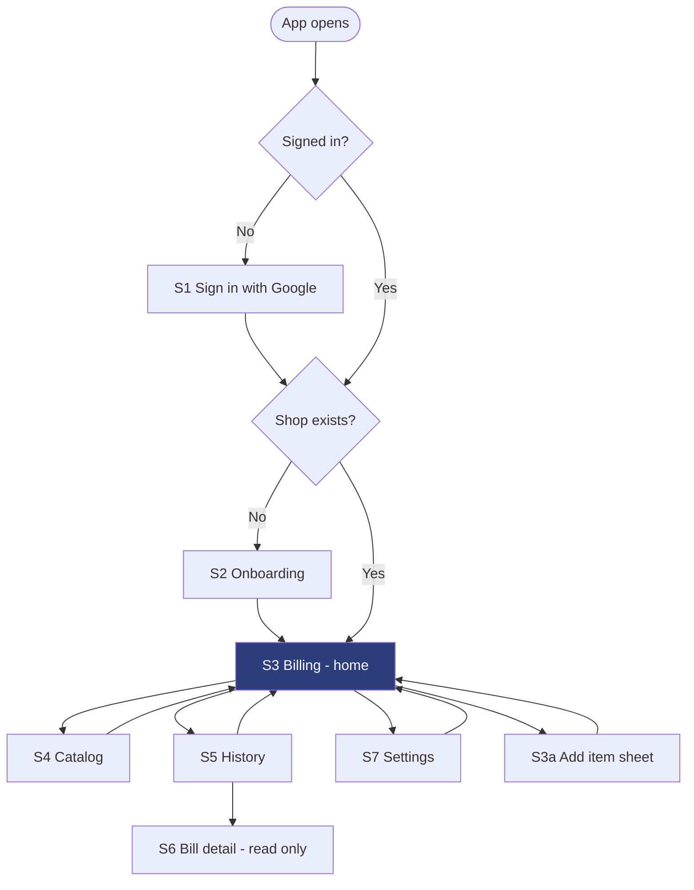
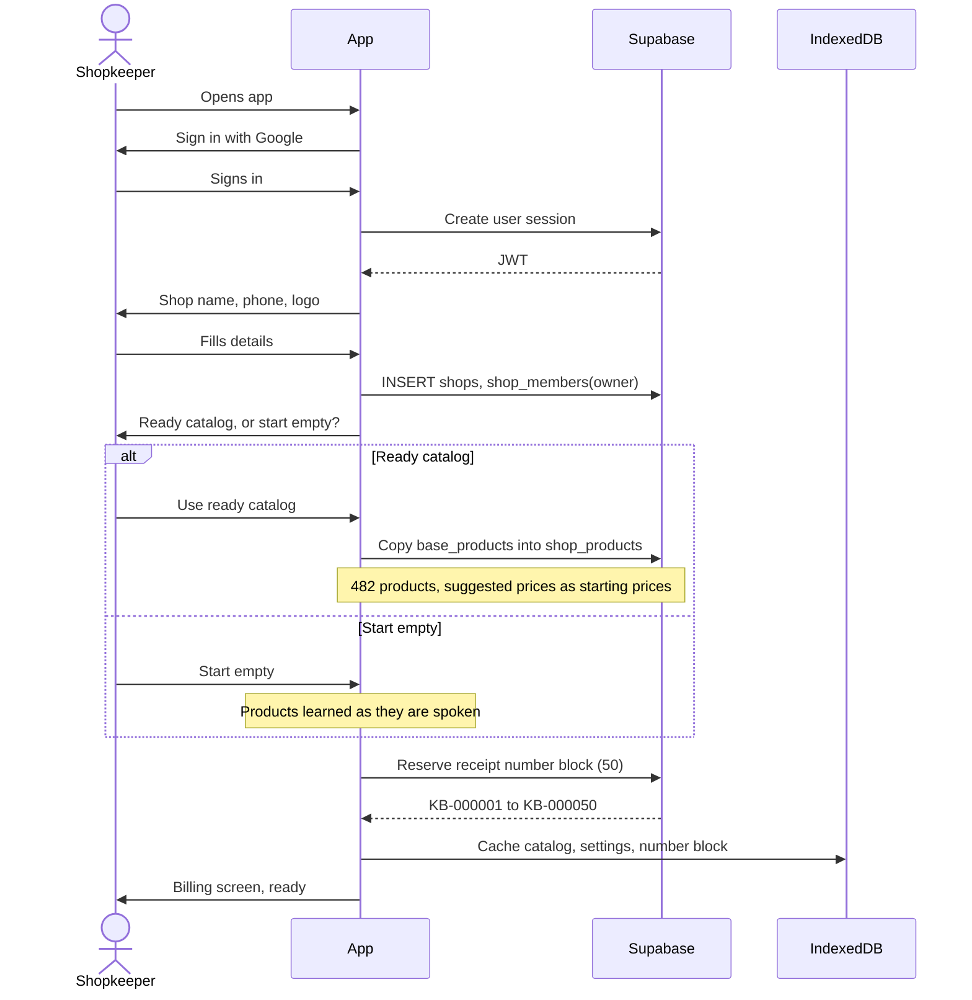
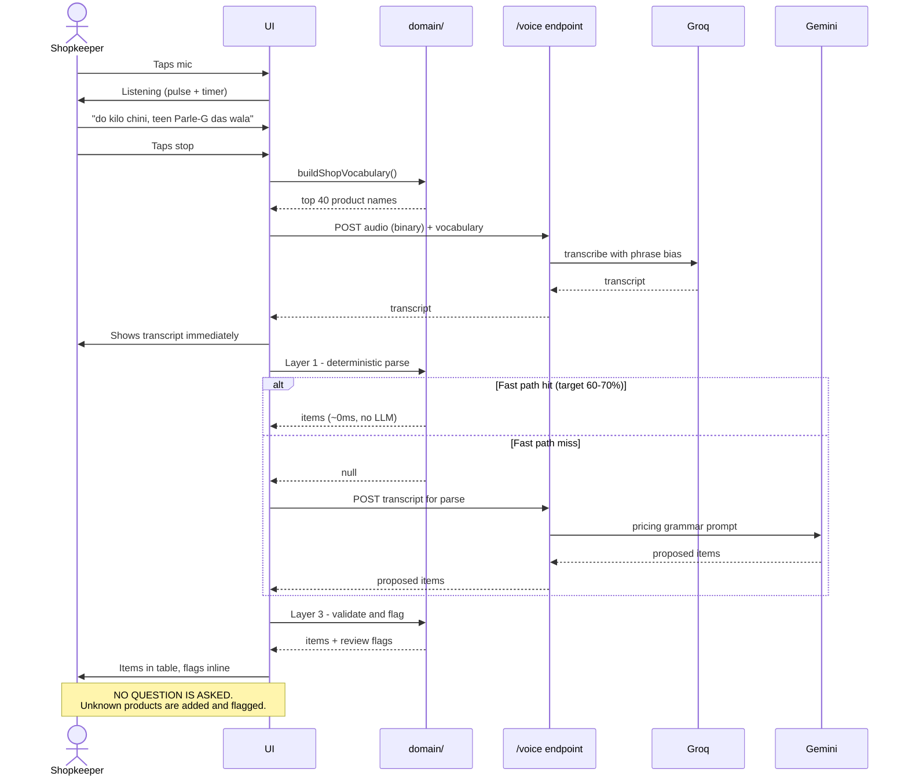
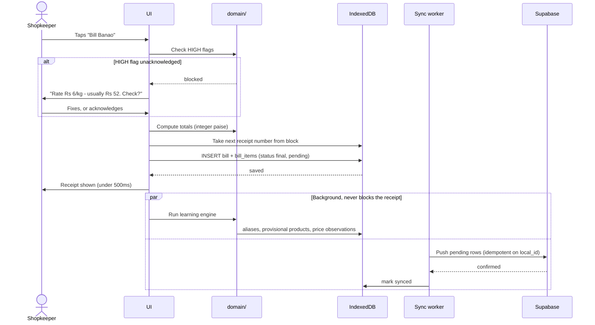
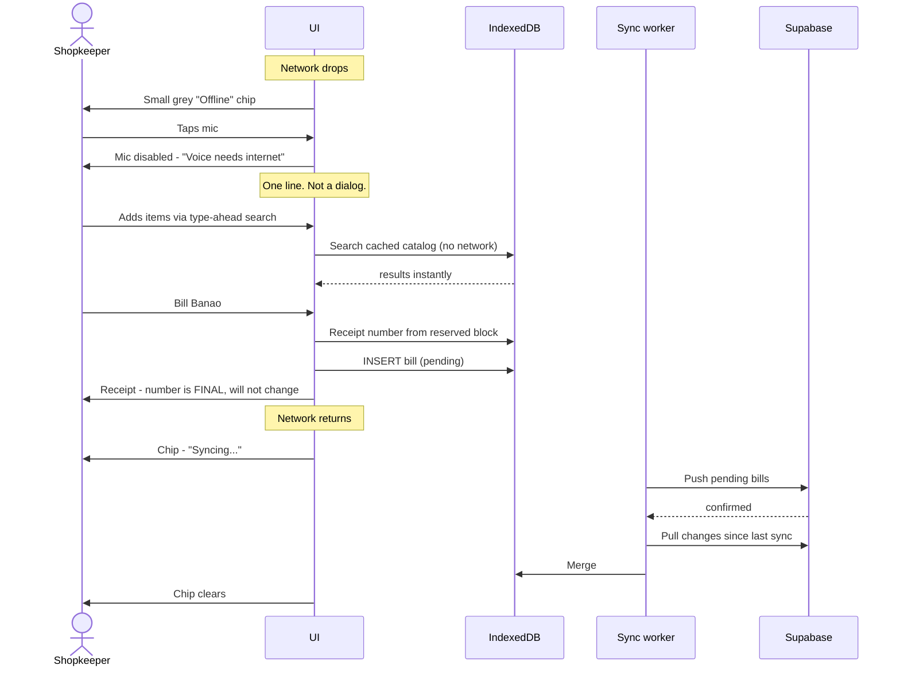
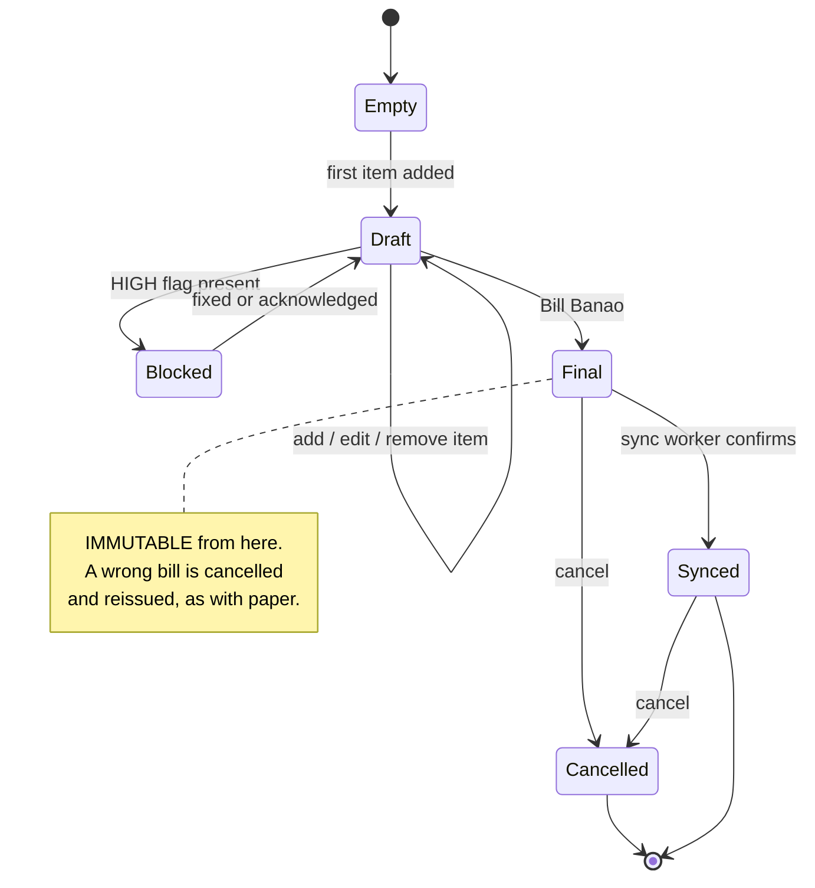
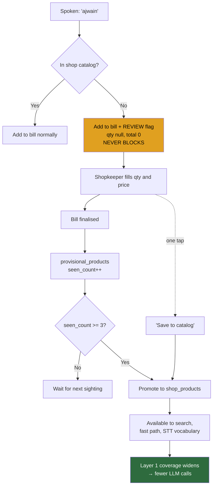
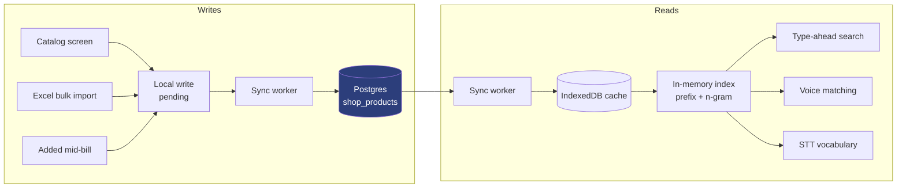

# 16 — App Flow

**Last updated:** 27 Sep 2026 · **Status:** Final for MVP

Journeys, sequences and state machines. `05-FRONTEND-SPEC.md` describes screens; this describes
how a person moves through them and what the system does underneath.

All diagrams are **Mermaid** — plain text, versioned in git, rendered by GitHub, and readable
directly by any AI tool.

---

## 1. Navigation map

**S3 Billing is home.** Every other screen is a detour that returns to it. The app opens on S3 and
the back action from anywhere returns to S3, never to a blank state.

---

## 2. First run

**The number block is reserved during onboarding**, so the very first bill works even if the network
drops immediately after. *(Built in `KB-315` — `bootstrapAfterOnboarding`, stamped with the device's persistent
id; a start with no usable block reserves again when online.)*

### Sign-out (added 27 Sep 2026, `KB-315`, `07-DECISIONS.md` D38)

Sign-out stops the sync loop, forgets this device's remembered user (so an offline restart can't resume as
them), and ends the Supabase session. **Local data is not deleted** — each user has their own local database,
and the same user signing back in continues where they left off, unsynced bills included.

**Built in `KB-313` (D65):** before signing out, if any
bills are still unsynced, **warn with the count** ("3 bills haven't reached the server yet — they'll stay on
this phone and sync when you sign back in"). Never a silent sign-out over unsynced bills. Bills that will never sync on their own (a permanent
conflict) get their own line, and a bill in progress is mentioned.

---

## 3. Voice billing — the one-turn flow

**Contrast with Pilloo**, which needs four turns for the same order — it blocks on each unknown
product and asks for a customer name.

---

## 4. Finalising a bill

**The receipt appears from a local write.** Sync and learning both happen after, and neither can
delay or fail the bill.

---

## 5. Offline billing and reconnection

**The receipt number never changes after sync.** That is what block reservation buys — a customer
holding a parchi with `KB-000042` will find `KB-000042` in the shop's records.

---

## 6. Bill state machine

**A draft is never lost** to a network drop, a tab switch, or the app being backgrounded. It lives
in IndexedDB from the first item.

---

## 7. New product learning

**Two promotion routes**: automatic at three sightings, or one tap when the shopkeeper already knows
they'll sell it again.

---

## 8. Catalog: source of truth and cache

**Postgres is the source of truth.** All three write paths are the same database write. The cache
exists so search is instant and works offline — above 10,000 products it falls back to server-side
search.

---

## 9. Error and edge behaviour

| Situation | Behaviour |
|---|---|
| Voice fails (network, STT error) | Inline message + "Add manually". Never a dead end. |
| Gemini fails after retries | Keep the transcript on screen, offer manual add. The transcript is not lost. |
| Unknown product | Added with a REVIEW flag. **Never blocks, never asks.** |
| HIGH number flag | Finalise blocked until fixed or acknowledged |
| Receipt number block exhausted offline | Device-prefixed fallback number, flagged, reconciled on sync |
| Sync fails repeatedly | Amber chip, tap for detail. **Billing continues.** |
| App backgrounded mid-bill | Draft in IndexedDB. Returns exactly as left. |
| Two devices, same shop | Out of MVP scope. One device per shop. |
| Product renamed after old bills exist | Old bills keep their `display_name` snapshot |

---

## 10. Where the thesis shows up in these flows

| Thesis element | Flow that enforces it |
|---|---|
| **One turn** | §3 — no question between mic and items |
| **Never blocks** | §3, §7 — unknown products flagged and kept |
| **Never silently wrong about a number** | §4 — HIGH flags gate finalisation |
| **Compounding** | §7 — learning widens fast-path coverage |
| **Works at the counter** | §5 — offline billing, receipt number never changes |
